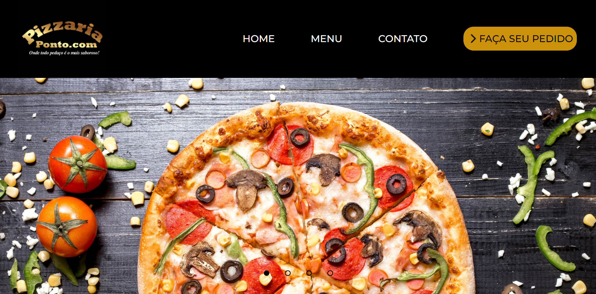
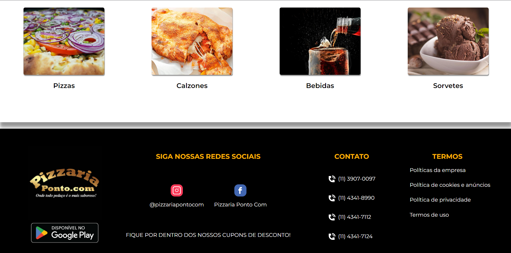

 

## :wave: Sobre o projeto

Desenvolvi esse site para a pizzaria Ponto.com visando treinar minhas habilidades com as tecnologias front-end, espero que goste do resultado! &#128521;

## :mag: Preview
<h3>First view</h3>
</img>
<h3>Footer</h3>

## :rocket: Tecnologias utilizadas
<ul>
 <li>HTML</li>
 <li>CSS</li>
 <li>JavaScript</li>
</ul>